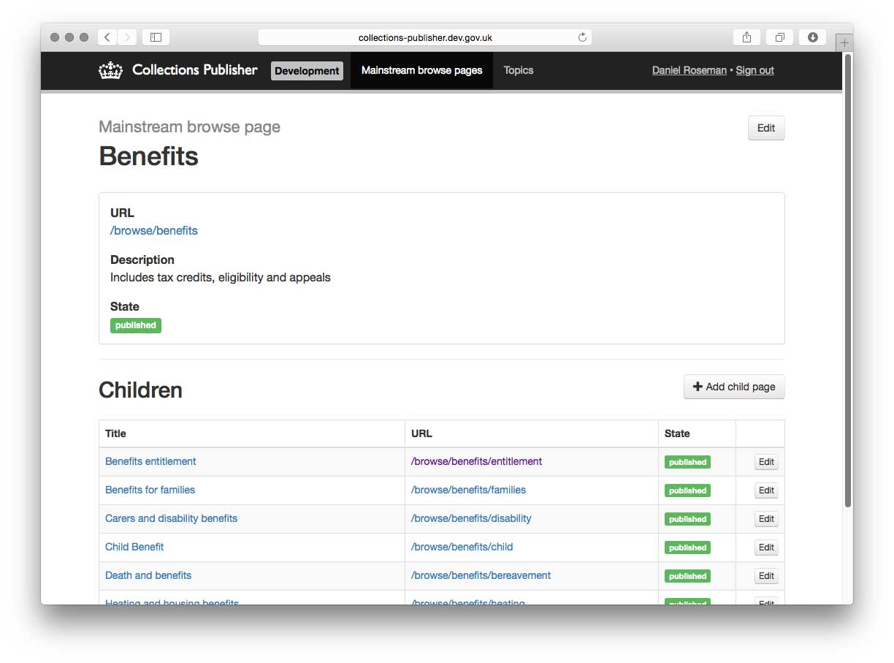
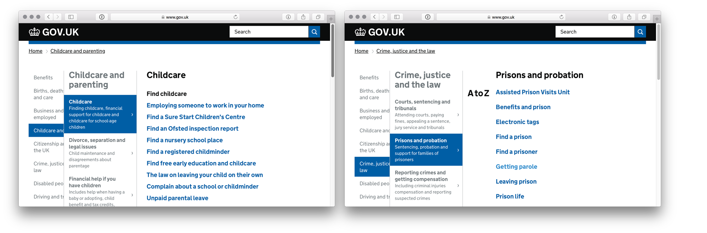

# Collections Publisher

The Collections Publisher publishes [/browse pages](https://www.gov.uk/browse/births-deaths-marriages/register-offices) and [/topic pages](https://www.gov.uk/topic/business-enterprise/export-finance). These pages are then served by the [collections app](https://github.com/alphagov/collections).



## Live examples

- [collections-publisher](https://collections-publisher.publishing.service.gov.uk/)

## Nomenclature

See the [README of collections frontend](https://github.com/alphagov/collections).

## Technical documentation

This is a Ruby on Rails application for internal use by GDS and some departmental editors.

It has these features:

- Creating & editing topics and mainstream browse pages.
- Curate the pages tagged to a topic or browse page into "curated lists". This means they'll be displayed in a group with a title. By default, the links are not curated and will appear with a 'A-Z' heading.



Left, a [curated mainstream browse page](https://www.gov.uk/browse/childcare-parenting/childcare), right, an [uncurated browse page](https://www.gov.uk/browse/justice/prisons-probation).

This application uses the [sidekiq](http://sidekiq.org/) message queue for background work (mainly publishing to the Publishing API).

### Dependencies

- [alphagov/publishing-api](https://github.com/alphagov/publishing-api) -
  - used for the publishing workflow of `mainstream_browse_page`s, `topic`s and curated lists.
  - Publishing API sends data onto [Rummager](https://github.com/alphagov/rummager) for search indexing `topic` and `mainstream_browse_page` pages.


### Running the application

```
bundle exec rails server
```

Ensure the dependencies are satisfied before
running. If you are using the development VM, run the app using bowler:

```
cd /var/govuk/development && bundle exec bowl collections-publisher
```

### Running the test suite

The test suite includes testing against
[govuk-content-schemas](http://github.com/alphagov/govuk-content-schemas), so
you will need a copy of this repo on your file system. By default this should
be in a sibling directory to your project. Alternatively, you can specify their
location with the `GOVUK_CONTENT_SCHEMAS_PATH` environment variable.

To run the test suite:

```
bundle exec rake
```

## Licence

[MIT License](LICENSE.txt)
